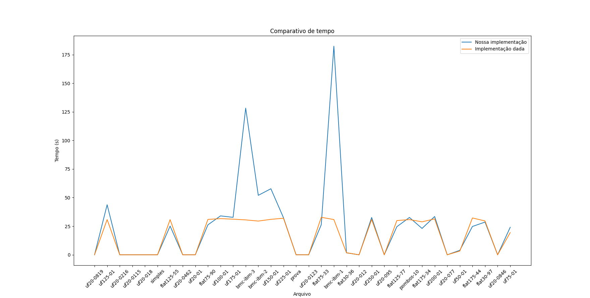

# BCP_PSPD

[Repositório de Desenvolvimento](https://github.com/GabrielTiveron/BCP_PSPD)

## Como usar


* Para escolher o número de threads que serão usadas pelo programa modifique a constante `MAX_THREAD` localizada no início do arquivo src/main.cpp.

* Na pasta base do projeto rode o seguinte comando para compilar o programa:
`make`

* Para executar o binário, execute o comando:
`./bin/prog`

## Arquitetura


## Algorítmo


O algorítmo de resolução das cláusulas funciona armazenando uma cópia de um vector com todas as cláusulas e variáveis para cada full e indo em cada cláusula para determinar seu valor e depois repetindo o processo para cada flip.

## Paralelização

O método de paralelização escolhido foi separar cada thread para resolver cada full e seus flips. Performance é perdida pois parte da verificação do valor das cláusulas é feito na thread pricipal enquanto os valores ainda são lidos.

## Possíveis otimizações

* Para melhorar a performance do programa é possível modificar as funções `para_verdadeiro` e `para_falso` para que a verificação dos valores das cláusulas e a execução da função `verifica_clausula` seja executada mais tarde no programa e tornar possível que seja executada em threads diferentes da principal.

<br>

* É possível mudar o cálculo dos flips na função `flip_variavel` para que todas as clausulas não precisem serm verificadas em cada flip.

* A verificação das clásulas pode começar a ser feita em threads antes de o input terminar de ser lido.

## Análise

Gere um relatório simples contendo gráficos de desempenho para as diversas execuções
Coloque a comparação da sua solução com a implementação sequencial fornecida;
Avalie o gargalo do seu algoritmo
### O maior problema acontece nas estruturas de controle (ex:semáforos)?

Não. O maior gargalo é no processamento, quando há um número muito elevado de flips.

### O tempo de leitura da entrada é perceptível?

Sim. Em entradas grandes é perceptível.

### Isole o tempo de execução da função que avalia a verificação (descontando o tempo de leitura da fórmula e de cada valoração full e flips)

Amostra de uma execução por arquivo com 4 threads.

* Processador: Intel Core i5 6600k 4 Cores 4 threads;

Com prints:
* flat75-90: 1.111s
* flat175-44: 41.053s
* uf125-01: 1m31.291s

Sem prints:
* flat75-90: 0.808s
* flat175-44: 10.451s
* uf125-01: 47.423s

<br>


### Qual é a complexidade do seu verificador?

Com as seguintes variáveis:
f = número de fulls
fl = número de flips
c = número de cláusulas
v = número de variáveis

O(f ((c v)+(fl+1)(c c + v c) + fl (v log(v)))))

### O seu algoritmo aproveita resultados parciais para avaliar flips mais rapidamente?

Sim. Para cada flip, é feito uma "nova versão" das clausulas, e para cada variável tida como verdadeira é diretamente feita uma valoração verdadeira as suas clausulas para que não sejam reavaliadas nessa "versão". Porém, é apenas aproveitado para casos onde há tautologias.

### Ambiente de teste

* Processador: Ryzen 3600X 6 Cores 12 threads;
* Memória RAM: 16 Gb, 2400 MHz;
* Disco Rígido: 480 Gb, Leitura: 500 Mb / s, Escrita 450 Mb / s.


### Resultados

Comparação dos resultados tendo em vista algumas quantias de threads.


Melhor desempenho



Comparativo com nosso foco de paralelização


### Consumo de memória

Os dados apresentados abaixo foram extraídos utilizando o comando ```/usr/bin/time -f "mem=%K RSS=%M elapsed=%E cpu.sys=%S .user=%U"``` seguido do comando de execução do programa principal.


