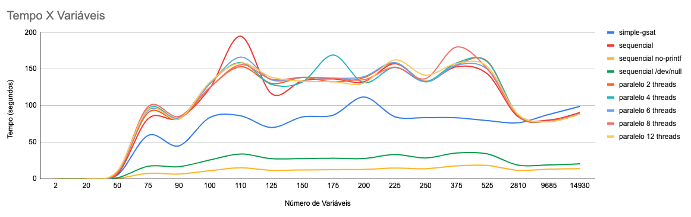
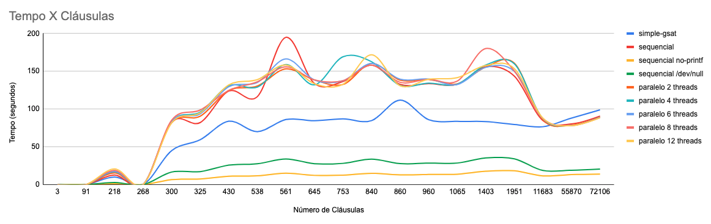
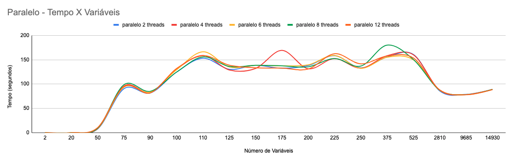
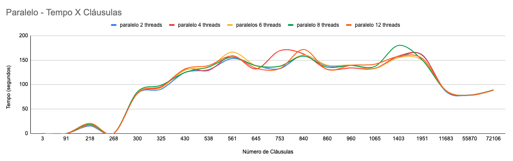
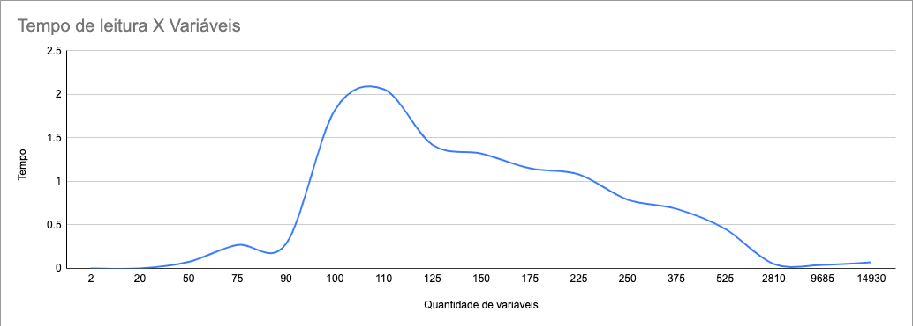
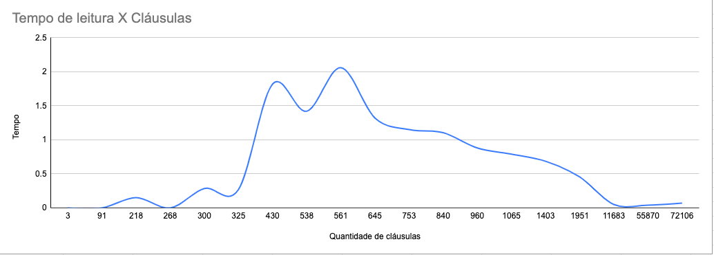
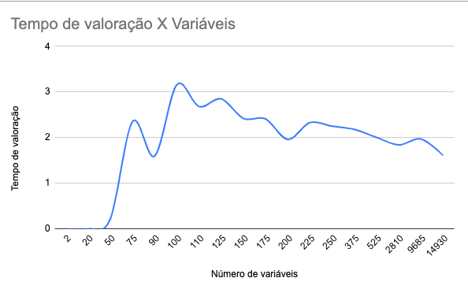
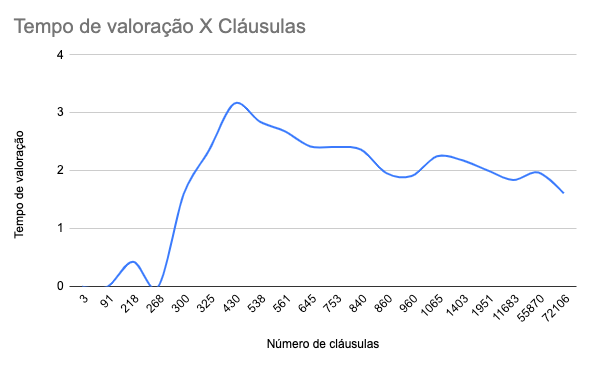
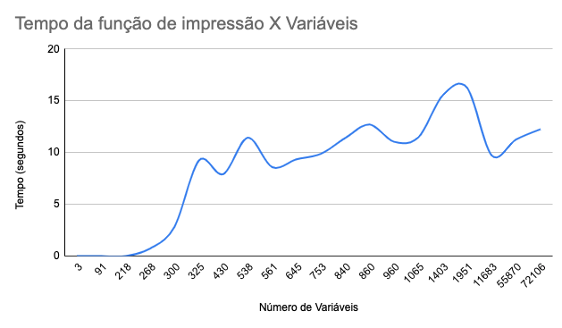
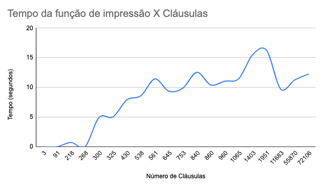

# Somativa 2 - PSPD


| Aluno(a) | Matricula |
| :--: | :--: |
| Gabriela Barrozo Guedes | 16/0121612 |
| Djorkaeff Alexandre Vilela Pereira | 16/0026822 |

# O projeto

Foi feito duas versões do código, uma paralela [(parallel.cpp)](./parallel.cpp) e uma sequencial [(sequencial.cpp)](./sequencial.cpp). Cuja a única diferença é a implementação de threads. Para a implementação das threads foram utilizados semaforos e mutex.

## Como rodar

Para compilar o programa sequencial:

```sh
make sequencial
```

Para compilar o programa paralelo:

```sh
make parallel
```

Rode o programa com:

```sh
make benchmark BENCHMARKBINARY=./bin
```

## Análise





**O desempenho é modificado quando impressão é comentada?**

Podemos observar que a execução sem prints é significamente mais rápida, considerando o alto gasto de realizar um operação de print. Operações de entrada e saída tem uma magnitude muito maior que operações simples de CPU.

**O desempenho é modificado quando o arquivo de saída é redirecionado para `/dev/null`?**

Ao enviar para `/dev/null` não está mais sendo executada as operações de IO, de forma que possui um comportamento similar a retirada dos prints.

**Como o desempenho é alterado rodando o programa com 2, 4, 6, 8 e 12 threads?**




O desempenho do programa ao mudar o número de threads não possui uma variação muito significativa, mas podemos perceber que para entradas extensas a solução que utiliza threads para paralelizar a valoração de cláusulas se torna mais eficaz que a solução sequencial.

Conforme o número de threads aumenta podemos notar uma diminuição no tempo de verificação para entradas entre 150 e 200 variáveis, entretanto após esse intervalo o tempo para solução com um maior número de threads aumenta.

O tempo não é altamente afetado quando o programa é executado utilizando mais threads devido ao gargalo do código estar sendo na função de impressão que é executada de forma sequencial, este gargalo foi encontrado ao longo da análise do código e suas execuções para a documentação.

**A partir de qual tamanho de fórmula a paralelização faz diferença?**

Os tempos da implementação paralela se tornam menores que a implementação padrão a partir de 2810 variáveis e 11683 cláusulas, ganhando da implementação sequencial em casos maiores que 9685 variáveis e 55850 cláusulas.

## Como é feita a otimização para paralelizar o algoritmo?

É utilizada uma estrutura de dados compartilhada por todo o código que é alterada a cada valoração. Ainda existe também uma estrutura de dados auxiliar que permite o aproveitamento de resultados parciais para a avaliação de valorações "flip", a estrutura permite ao algoritimo encontrar em O(1) se uma variável existe dentro de uma cláusula.

Para a utilização da estrutura de dados compartilhada foi necessário o uso de um mutex, de modo que não ocorram alterações concorrentes nessa estrutura de dados.

A otimização é feita dentro de cada valoração recebida ("full" ou "flip"), de forma que a verificação é feita em multiplas threads que dividem a valoração parcial em intervalos de cláusulas.

Considerando o tempo gasto para a criação de threads, foi utilizado um esquema de semáforos e a criação das threads foi realizada apenas uma vez, cada thread é criada e inicializada e aguarda por um sinal de semáforo.

Os intervalos de cláusulas de cada thread são definidos no inicio do programa após a leitura da entrada principal, de acordo com o número de threads.

Após a leitura de uma valoração as threads são liberadas e utilizando o seu indice encontra o intervalo e calcula as cláusulas dentro do seu intervalo.

## Avaliando o gargalo do algoritmo

**O maior problema acontece nas estruturas de controle?**

Dentre os gargalos observados, estão a estrutura de controle mutex, que impede threads concorrentes de acessarem o mesmo recurso compartilhado.

A impressão dos resultados, que faz necessária a ordenação dos literais que produziram valores negativos após a valoração e a ordenação da lista de indices de cláusulas que não foram satisfeitas.

Considerando o recurso global de resultado, o tempo gasto para realizar alterações após a valoração também é consideravel, visto que temos que atualizar a lista de indice de cláusulas não satisfeitas e o contador de literais com valores negativos.

Os intervalos de cláusulas subdivididos entre as threads não utilizam de uma estrura de dados que permita a divisão igualitária de trabalho para cada thread, considerando que há cláusulas que não precisarão ser recalculadas poderá haver um desbalanceamento, e uma thread fazer mais trabalho do que as outras, bloqueando assim a execução do programa.

A execução do programa e a leitura de entrada é bloqueada durante a execução da valoração da leitura anterior. Não há uma lógica de produção e consumação paralela.

A estrutura de dados utilizada para o armazenamento de cláusulas não satisfeitas faz necessário uma reordenação no momento da impressão do resultado, o que poderia ter sido evitado utilizando mais memoria com um array que possui tamanho igual ao número de cláusulas e inicializado em zero e a cada cláusula não satisfeita encontrada poderiamos marcar em O(1) a posição referente a cláusula e para impressão não seria necessário a ordenação.

**Qual o impacto da leitura do arquivo de entrada no tempo global?**




O tempo gasto para a leitura é muito baixo comparado com o tempo de execução, isolamos o tempo de leitura do algoritmo e o tempo máximo gasto para a leitura foi de 2,06 segundos em entradas muito extensas.


**Isole o tempo de execução da função que avalia a verificação**




Ao fazer a análise do tempo somente da valoração, descontando o tempo da leitura e sem o processamento para a impressão dos resultados, podemos perceber que o real gargalo do algoritmo está no momento da impressão, visto somente o processamento de valoração possui o tempo muito abaixo ao tempo do algoritmo completo.

Para comprovar essa análise, foi feito um gráfico, com os tempos da solução sequencial sem os prints tirando o tempo da valoração e da leitura, dessa forma temos os gráficos abaixo que se assemelham a curvatura dos gráficos da solução completa, comprovando que essa função é o maior gargálo do algoritmo. 




**Qual é a complexidade do seu verificador?**

Avaliando a estrutura do código, sem a otimização da estrutura de dados para os "flips", a solução seria O(n*m), entretando, com a otimização, o que ocorre, é que muitos casos não passam pelos loops, por já terem sido verificados, aproximando o algoritmo a uma complexidade O(log n), como pode ser visto pelos gráficos.

**O seu algoritmo aproveita resultados parciais para avaliar flips mais rapidamente?**

É utilizado uma estrutura de dados compartilhada que otimiza a execução do algoritimo em casos de "flip", armazenando resultados parciais e realizando a verificação se uma variável está em uma cláusula em O(1).


