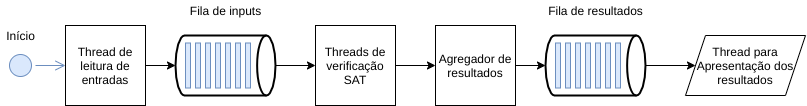
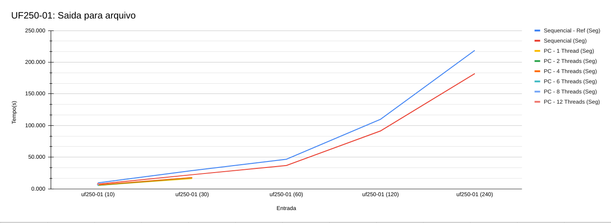
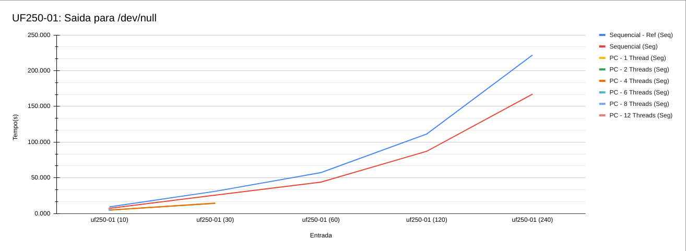
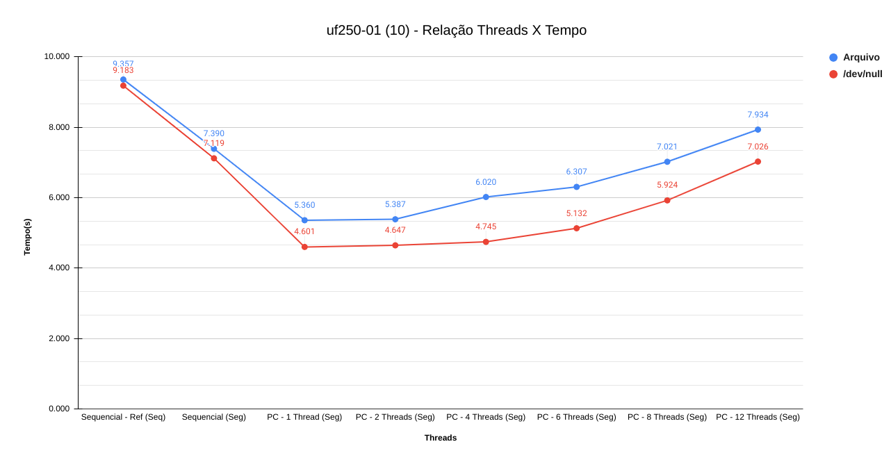
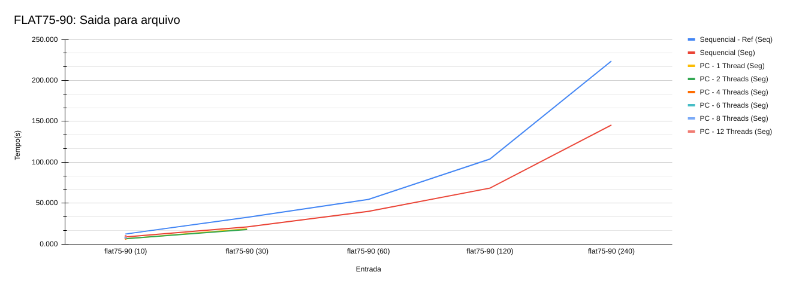
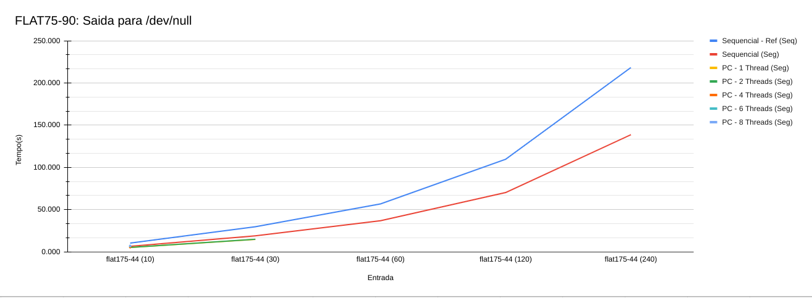
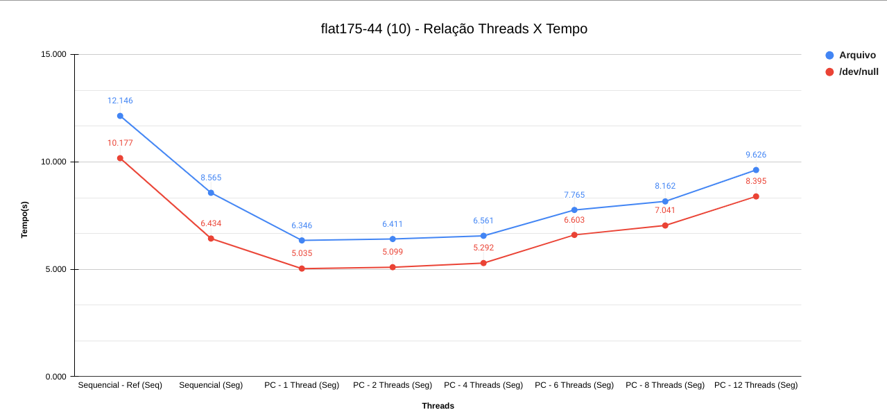

# Verificador SAT

| Aluno | Matrícula |
| --- | --- |
| Eugênio Sales Siqueira | 17/0033112 |
| Lucas Maciel Aguiar | 17/0070735 |

Durante todo o processo de desenvolvimento deste trabalho, foi implementado e testado diversas soluções. Primeiramente foi desenvolvido um algoritmo sequencial para comparar com a versão sequencial de referência fornecida pelo professor. Após a conclusão desta solução foram desenvolvidas soluções de algoritmos paralelos para realizar tentativas de otimizar um problema que parece ser paralelizável.
Abaixo é apresentado o histórico da implementação de cada solução e seus respectivos resultados.

## 1. Algoritmo Sequencial

* __Código fonte:__ sequential.c

No algoritmo  sequencial foi realizado uma tentativa de otimização de FLIPs por meio da ordenação de literais no momento da leitura das cláusulas. Após ordenados, no momento da verificação é realizado uma busca binária para recuperar o literal correspondente ao "FLIP" da variável.
Outro ponto, é que o histórico de literais falsos é mantido entre os testes e durante as verificações, alterações são realizadas quando necessário.

## 2. Algoritmo Paralelizado

* __Código fonte:__ naive_parallelization.c

Essa foi a primeira tentativa de paralelização. O algoritmo foi baseado na versão sequencial e apenas foi adicionado threads que são criadas a cada caso de teste.
Nesse algoritmo e nas próximas versões paralelizadas __não foi realizado a otimização de FLIPs__.

### 2.1 Problemas encontrados

* Atrasos devido a criação de threads e as joins de threads para cada caso de teste
* O aumento de threads causa um congestionamento nas regiões crítica. Isso faz com que ocorram atrasos.

## 3. Produtor-Consumidor

* __Código fonte:__ producer_consumer.c

Com a intenção de se reduzir o atraso gerado pela criação de threads a cada teste, foi implementado uma versão paralelizada que utiliza princípios de produtor-consumidor. Portanto as threads de verificação são iniciadas no início do programa.
A entrada de dados e a saída do resultado foram extraídas para uma thread dedicada para cada uma. A entrada injeta os dados em uma fila e avisa a thread de verificação sat por meio de semáforos quando uma nova entrada é lida. Por fim, as threads de verificação geram resultados parciais que são unidos em uma fila de resultados.
Por tanto, inicialmente, o programa já inicia com 4 threads (1 para a main do programa + 1 para a entrada + 1 para a verificação + 1 para a saída).

__Nesse algoritmo também não foi implementado uma otimização para os FLIPs.__

### 3.1 Problemas encontrados

* O aumento de threads, __principalmente na função responsável por agregar os resultados parciais e inserir os resultados na fila de resultados__, causa um congestionamento nas regiões crítica. Isso faz com que ocorram atrasos.
* A utilização de filas com o histórico de entrada e de resultados gera um consumo excessivo de memória que faz com que o programa seja forçado a encerrar. Em certas ocasiões a partir de uma quantidade de entradas e de threads alocadas (que gera mais consumo de memória devido as estruturas de controle), ocorrem erros de __Segmentation Fault__.

## 4. Medições de Desempenho

As medições de desempenho detalhadas podem ser conferidas por meio desta [planilha](https://docs.google.com/spreadsheets/d/1-bzVvoHRxSVZhAaey-jIAic2nKJhP91ONyWB6rF6ZnE/edit?usp=sharing).

### 4.1 Gráficos de desempenho

* Obs: As células marcadas com "*" significam que não foi possível realizar a medição do algoritmo com a entrada fornecida. No caso da versão de produtor/consumidor, isso ocorreu devido a uma extrapolação do uso de memória.

#### 4.1.1 UF 250

__Performance com saída para arquivo:__

| Entrada        | Variaveis | Clausulas | Num Fulls | Num de Flips | Leitura (Seg) | Sequencial - Ref | Sequencial | 1 Thread | 2 Threads | 4 Threads | 6 Threads | 8 Threads | 12 Threads |
| -------------- | --------- | --------- | --------- | ------------ | ---------------------- | ---------------------- | ---------------- | ------------------- | -------------------- | -------------------- | -------------------- | -------------------- | --------------------- |
| uf250-01 (10)  | 250       | 1065      | 128       | 321427       | 0.034                  | 9.357                  | 7.390            | 5.360               | 5.387                | 6.020                | 6.307                | 7.021                | 7.934                 |
| uf250-01 (30)  | 250       | 1065      | 391       | 984992       | 0.090                  | 28.632                 | 22.208           | 16.145              | 17.488               | 17.717               | *                | *                | *                 |
| uf250-01 (60)  | 250       | 1065      | 669       | 1687497      | 0.148                  | 46.571                 | 36.802           | *               | *                | *                | *                | *                | *                 |
| uf250-01 (120) | 250       | 1065      | 1567      | 3952875      | 0.340                  | 109.723                | 91.340           | *               | *                | *                | *                | *                | *                 |
| uf250-01 (240) | 250       | 1065      | 3124      | 7880016      | 0.677                  | 218.573                | 181.865          | *               | *                | *                | *                | *                | *                 |

__Performance com saída para /dev/null:__

| Entrada        | Variaveis | Clausulas | Num Fulls | Num de Flips | Leitura (Seg) | Sequencial - Ref | Sequencial | 1 Thread | 2 Threads | 4 Threads | 6 Threads | 8 Threads | 12 Threads |
| -------------- | --------- | --------- | --------- | ------------ | ---------------------- | ---------------------- | ---------------- | ------------------- | -------------------- | -------------------- | -------------------- | -------------------- | --------------------- |
| uf250-01 (10)  | 250       | 1065      | 128       | 321427       | 0.034                  | 9.183                  | 7.119            | 4.601               | 4.647                | 4.745                | 5.132                | 5.924                | 7.026                 |
| uf250-01 (30)  | 250       | 1065      | 391       | 984992       | 0.090                  | 30.979                 | 25.556           | 14.060              | 14.198               | 14.483               | *                | *                | *                 |
| uf250-01 (60)  | 250       | 1065      | 669       | 1687497      | 0.148                  | 57.127                 | 43.921           | *               | *                | *                | *                | *                | *                 |
| uf250-01 (120) | 250       | 1065      | 1567      | 3952875      | 0.340                  | 111.200                | 87.053           | *               | *                | *                | *                | *                | *                 |
| uf250-01 (240) | 250       | 1065      | 3124      | 7880016      | 0.677                  | 221.895                | 167.091          | *               | *                | *                | *                | *                | *                 |

__Relação Threads X Tempo:__

#### 4.1.2 FLAT 75 90

__Performance com saída para arquivo:__

| Entrada         | Variaveis | Clausulas | Num Fulls | Num de Flips | Leitura (Seg) | Sequencial - Ref | Sequencial | 1 Thread | 2 Threads | 4 Threads | 6 Threads | 8 Threads | 12 Threads |
| --------------- | --------- | --------- | --------- | ------------ | ---------------------- | ---------------------- | ---------------- | ------------------- | -------------------- | -------------------- | -------------------- | -------------------- | --------------------- |
| flat75-90 (10)  | 525       | 1951      | 38        | 197391       | 0.046                  | 12.146                 | 8.565            | 6.346               | 6.411                | 6.561                | 7.765                | 8.162                | 9.626                 |
| flat75-90 (30)  | 525       | 1951      | 113       | 594054       | 0.124                  | 32.583                 | 20.901           | 18.448              | 17.622               | *                | *                | *                | *                 |
| flat75-90 (60)  | 525       | 1951      | 215       | 1139178      | 0.234                  | 54.436                 | 39.877           | *               | *                | *                | *                | *                | *                 |
| flat75-90 (120) | 525       | 1951      | 408       | 2161887      | 0.439                  | 103.770                | 68.249           | *               | *                | *                | *                | *                | *                 |
| flat75-90 (240) | 525       | 1951      | 869       | 4603871      | 0.966                  | 223.475                | 145.398          | *               | *                | *                | *                | *                | *                 |

__Performance com saída para /dev/null:__

| Entrada          | Variaveis | Clausulas | Num Fulls | Num de Flips | Leitura (Seg) | Sequencial - Ref | Sequencial | 1 Thread | 2 Threads | 4 Threads | 6 Threads | 8 Threads | 12 Threads |
| ---------------- | --------- | --------- | --------- | ------------ | ---------------------- | ---------------------- | ---------------- | ------------------- | -------------------- | -------------------- | -------------------- | -------------------- | --------------------- |
| flat175-44 (10)  | 525       | 1951      | 38        | 197391       | 0.046                  | 10.177                 | 6.434            | 5.035               | 5.099                | 5.292                | 6.603                | 7.041                | 8.395                 |
| flat175-44 (30)  | 525       | 1951      | 113       | 594054       | 0.124                  | 29.621                 | 18.875           | 14.595              | 14.769               | *                | *                | *                | *                 |
| flat175-44 (60)  | 525       | 1951      | 215       | 1139178      | 0.234                  | 56.591                 | 36.713           | *               | *                | *                | *                | *                | *                 |
| flat175-44 (120) | 525       | 1951      | 408       | 2161887      | 0.439                  | 109.542                | 70.133           | *               | *                | *                | *                | *                | *                 |
| flat175-44 (240) | 525       | 1951      | 869       | 4603871      | 0.966                  | 218.236                | 138.669          | *               | *                | *                | *                | *                | *                 |

__Relação Threads X Tempo:__

## 6. Como Rodar

### 6.1 Compilação

    gcc producer_consumer.c -O2 -static -pthread -o pc

### 6.2 Execução do algoritmo para um arquivo de entrada e saida

    ./pc (NUMERO_THREADS) < (LOCALIZACAO_ARQUIVO_INPUT) > (LOCALIZACAO_ARQUIVO_OUTPUT)

__Valores padrão dos argumentos:__

* NUMERO_THREADS = 1
