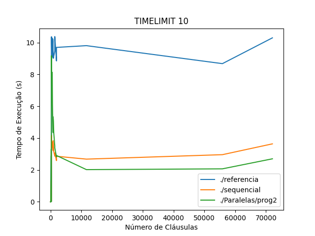
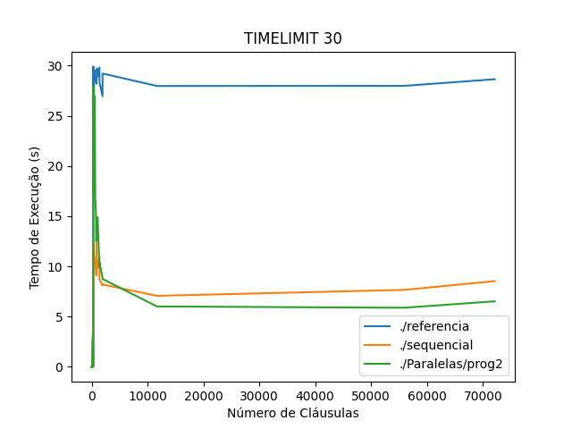
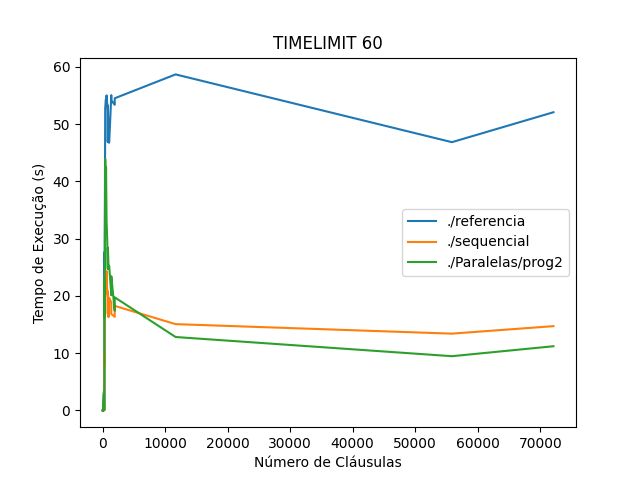
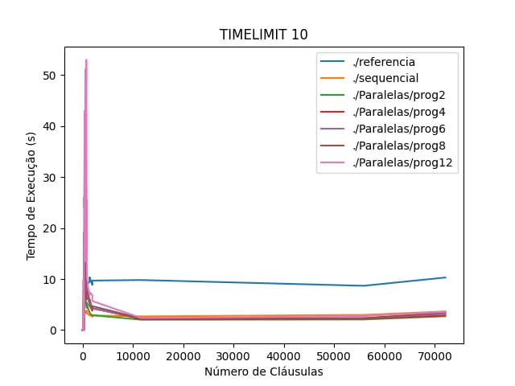
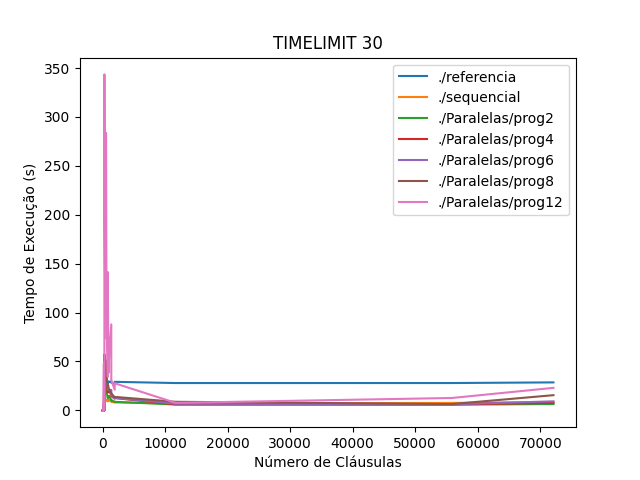

# BCP - Somativa 2 PSPD

## Estratégia de Implementação

### Estrutura de Dados

Foram utilizadas 3 estruturas, sendo elas:

- Vetor da struct *Valoracao*, que possui:
    - Lista encadeada dos índices das cláusulas em que a variável está negada;
    - Lista encadeada dos índices das cláusulas em que a variável não está negada;
    - *literal_verdadeiro*, *int* recebido na valoração;
    - *literal_alterado*, *int* que informa se o literal verdadeiro foi alterado ou não na entrada *full*.

- Vetor de cláusulas (*Clausula*), com:
    - *quantidade_literais_verdadeiros*, para verificar se a cláusula foi aceita ou não;
    - Lista encadeada dos seus literais.

- Dois vetores *Ponteiro_Lit*, sendo um para ordenar e o outro para acesso rápido;
    - Salvam os dados necessários (*literal*, *literal_absoluto* e *numero_clausulas_falsas*) para aproveitar resultados parciais e avaliar as valorações mais rapidamente.

## Parser de Entrada

O índice de um elemento é igual ao elemento absoluto subtraído de um.

    - A valoração do literal 1 estará no índice 0 do vetor de *Valoracao*;

## Propagação

### Inicialização

- Primeiro, alocamos memória baseando-se no tamanho da entrada, dado pelas variáveis **numero_variaveis** e **numero_clausulas**;

- Depois, recebemos as entradas do usuário e salvamos as respectivas entradas nas estruturas de dados condizentes com cada uma delas:
    - Salvamos os indíces das cláusulas no vetor de *Valoracao*;
    - Salvamos os literais nas clausulas do vetor de *Clausula*;

### Execução

- Analisamos as *n* variáveis que alteraram o valor;
- Avaliamos as *o* cláusulas em que a variável aparace na forma de um literal não negado;
- Avaliamos as *p* cláusulas em que a variável aparece na forma de um literal negado;
- Verificamos a necessidade de atualizar a contagem de cláusulas falsas dos seus literais; 

## Estratégia de Paralelização

A estratégia de paralelização utilizada é parecida com a estratégia produtor-consumidor. Na nossa estratégia, as threads trabalham consumindo os índices das valorações que foram alteradas.

Mas, depois de realizar os passos necessários para tratar uma mudança de valoração, dividem o trabalho de apresentação dos resultados. Enquanto uma thread imprime as cláusulas falsas, outra ordena o vetor lits e prepara a sua impressão.

## Gráficos de Desempenho

### Gráfico - Entradas TIMELIMIT=10
        

### Gráfico - Entradas TIMELIMIT=30
   

### Gráfico - Entradas TIMELIMIT=60   
       

    - Colocando o gráfico em função das variáveis, obtém-se um resultado extremamente parecido;

## Performance e Gargalos

### Diferenças entre a Sequencial e Paralelizada

- Para entradas pequenas, **com menos de 1500 cláusulas**, as implementações paralelizadas perdem perfomance, pois os ganhos de performance advindos da estratégia aplicada não suprem os custos no gerenciamento das threads. Dessa forma, quanto mais threads, mais perda;

- Para entradas grandes, **com mais de 10000 cláusulas**, os ganhos de performance passam a serem maiores que os custos de gerenciamento;

- Não foi encontrado tamanho de entrada que o programa não conseguisse tratar, mas não foram testadas entradas criadas com TIMELIMIT superior a 120;

- O programa tem o seu melhor desempenho com **2-3 threads** e tem seu desempenho afetado negativamente a partir de **8 threads**, como podemos ver abaixo:

### Gargalo do algoritmo

- O maior gargalo do algoritmo é a impressão dos resultados, tendo em vista que mesmo a solução sequencial não possuiu muitos problemas de performance para processar entradas relativamente grandes.

### Comentar impressão

- Ao comentar as impressões houve uma melhora substancial no tempo de execução.
