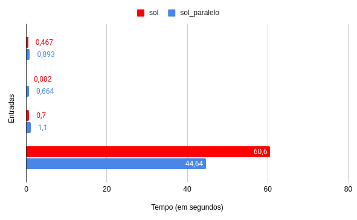
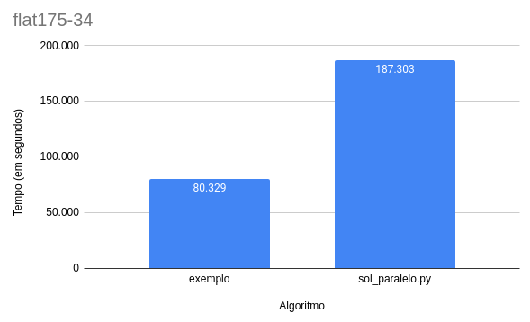
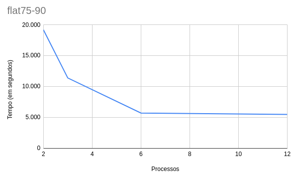

## Verificador de Valoração

### Alunos

- João Vítor Morandi Lemos / 160010195
- José Aquiles Guedes de Rezende / 160010331

### Estruturas utilizadas

- Sequencial
- Multiprocesso com memória compartilhada

### Comparação entre o nosso sequencial e nosso paralelo

#### Entradas:

- prova
- simples
- uf20-01
- uf50-01



### Comparação com o código de exemplo



### Comparação com a quantidade de processos simultâneos



Para ver o histórico de commits do trabalho, acesse o [repositório original](https://github.com/aquiles23/Boolean-Constraint-Propagator).

### Requisitos

- Python3

### Para executar a solução sequencial

```
./sol.py
```
ou para usar um arquivo de input

```
./sol.py < ../input/flat75-90
```

### Para executar a solução paralela

```
./sol_paralelo.py num_cores
```

onde `num_cores` é o numero de processos simultaneos que deseja rodar.

para usar um arquivo de input
```
./sol_paralelo.py num_cores < ../input/flat75-90
```
