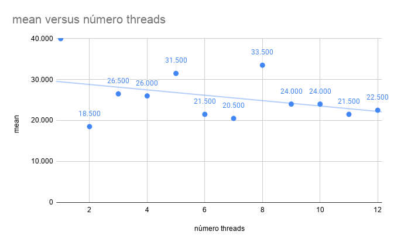
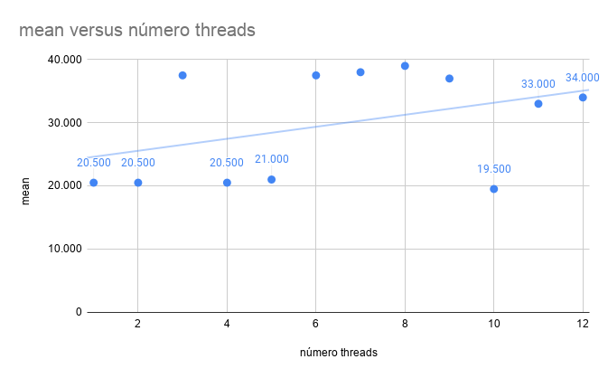
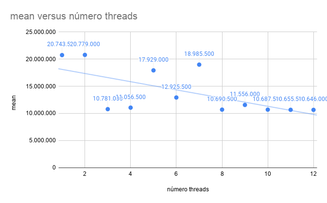
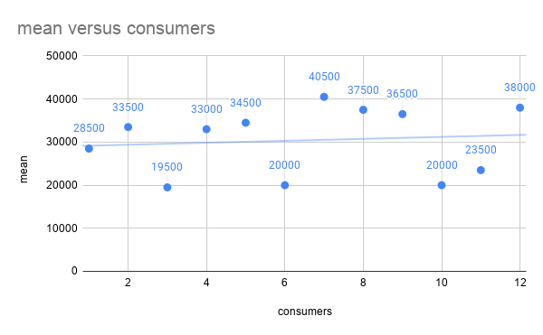
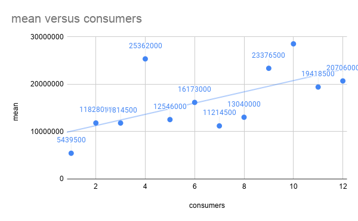
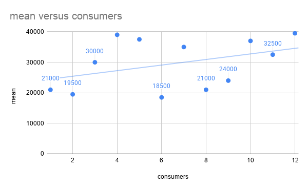
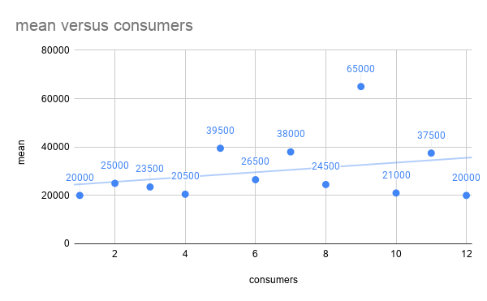
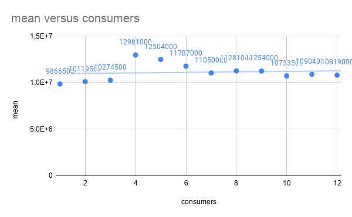

# Relatório da Atividade do BCP

# Explicações iniciais   
Para essa aplicação foram feitas 4 abordagens diferentes para solucionar o problema:
1. BCP serial;
2. BCP utilizando apenas threading dando create and join para a quantidades solicitadas de 1 a 12;
3. BCP utilizando producer e consumer onde a quantidade de consumer aumenta conforme o padrão fornecido;
4. BCP utilizando producer e consumer e dividindo igualmente o vetor de argumentos para realizar os calculos.
Por exemplo se tiver 2 consumers vai dividir a quantidade de argumentos para as funções em 2 para todos os
consumers terem a mesma quantidade de argumentos para processar;

## Observação

Todas as metodologias vão ser descritas durante o relatório.
O tempo do `time` foi pego o argumento real em ms;

## Arquivos

Os arquivos de teste foram os arquivos contidos nesse repositório:
1. simple -> 4.0 K
2. uf20-01 -> 4.0 K
3. flat75-90 -> 288 K

## Tempo de execução de cada abordagem para cada abordagem: 

### Serial
|arquivo|número de threads|real-1|real-2|mean|
|---|---|---|---|---|
| simple |1|13.000|14.000|13.500|

|arquivo|número de threads|real-1|real-2|mean|
|---|---|---|---|---|
| uf20-01 |1|18.000|14.000|16.000|

|arquivo|número de threads|real-1|real-2|mean|
|---|---|---|---|---|
| flat75-90 |1|8922.000|8943.000|8932.500|

### Thread

|arquivo| número threads| real-1| real-2| mean|
|---|---|---|---|---|
|simple| 1| 59.000| 21.000| 40.000|
|simple| 2| 20.000| 17.000| 18.500|
|simple| 3| 32.000| 21.000| 26.500|
|simple| 4| 32.000| 20.000| 26.000|
|simple| 5| 33.000| 30.000| 31.500|
|simple| 6| 24.000| 19.000| 21.500|
|simple| 7| 21.000| 20.000| 20.500|
|simple| 8| 37.000| 30.000| 33.500|
|simple| 9| 25.000| 23.000| 24.000|
|simple| 10| 24.000| 24.000| 24.000|
|simple| 11| 24.000| 19.000| 21.500|
|simple| 12| 25.000| 20.000| 22.500|

|arquivo| número threads| real-1| real-2| mean|
|---|---|---|---|---|
|uf20-01| 1| 23.000| 18.000| 20.500|
|uf20-01| 2| 23.000| 18.000| 20.500|
|uf20-01| 3| 54.000| 21.000| 37.500|
|uf20-01| 4| 23.000| 18.000| 20.500|
|uf20-01| 5| 23.000| 19.000| 21.000|
|uf20-01| 6| 55.000| 20.000| 37.500|
|uf20-01| 7| 53.000| 23.000| 38.000|
|uf20-01| 8| 57.000| 21.000| 39.000|
|uf20-01| 9| 54.000| 20.000| 37.000|
|uf20-01| 10| 21.000| 18.000| 19.500|
|uf20-01| 11| 45.000| 21.000| 33.000|
|uf20-01| 12| 46.000| 22.000| 34.000|

|arquivo| número threads| real-1| real-2| mean|
|---|---|---|---|---|
|flat75-90| 1| 30594.000| 10893.000| 20743.500|
|flat75-90| 2| 10725.000| 30833.000| 20779.000|
|flat75-90| 3| 10761.000| 10801.000| 10781.000|
|flat75-90| 4| 11342.000| 10771.000| 11056.500|
|flat75-90| 5| 25187.000| 10671.000| 17929.000|
|flat75-90| 6| 10744.000| 15107.000| 12925.500|
|flat75-90| 7| 10632.000| 27339.000| 18985.500|
|flat75-90| 8| 10680.000| 10701.000| 10690.500|
|flat75-90| 9| 12418.000| 10694.000| 11556.000|
|flat75-90| 10| 10744.000| 10631.000| 10687.500|
|flat75-90| 11| 10665.000| 10646.000| 10655.500|
|flat75-90| 12| 10672.000| 10620.000| 10646.000|

### Producer Consumer

|arquivo| consumers| real-1| real-2| mean|
|---|---|---|---|---|
|simple| 1| 40.000| 17.000| 28.500|
|simple| 2| 45.000| 22.000| 33.500|
|simple| 3| 21.000| 18.000| 19.500|
|simple| 4| 43.000| 23.000| 33.000|
|simple| 5| 50.000| 19.000| 34.500|
|simple| 6| 22.000| 18.000| 20.000|
|simple| 7| 46.000| 35.000| 40.500|
|simple| 8| 53.000| 22.000| 37.500|
|simple| 9| 47.000| 26.000| 36.500|
|simple| 10| 22.000| 18.000| 20.000|
|simple| 11| 25.000| 22.000| 23.500|
|simple| 12| 55.000| 21.000| 38.000|

|arquivo| consumers| real-1| real-2| mean|
|---|---|---|---|---|
|uf20-01| 1| 23.000| 18.000| 20.500|
|uf20-01| 2| 44.000| 19.000| 31.500|
|uf20-01| 3| 20.000| 18.000| 19.000|
|uf20-01| 4| 19.000| 20.000| 19.500|
|uf20-01| 5| 45.000| 22.000| 33.500|
|uf20-01| 6| 30.000| 31.000| 30.500|
|uf20-01| 7| 55.000| 21.000| 38.000|
|uf20-01| 8| 21.000| 21.000| 21.000|
|uf20-01| 9| 54.000| 19.000| 36.500|
|uf20-01| 10| 21.000| 18.000| 19.500|
|uf20-01| 11| 26.000| 27.000| 26.500|
|uf20-01| 12| 49.000| 21.000| 35.000|

|arquivo| consumers| real-1| real-2| mean|
|---|---|---|---|---|
|flat75-90| 1| 1120.000| 9759.000| 5439.500|
|flat75-90| 2| 12473.000| 11183.000| 11828.000|
|flat75-90| 3| 10882.000| 12747.000| 11814.500|
|flat75-90| 4| 34249.000| 16475.000| 25362.000|
|flat75-90| 5| 12056.000| 13036.000| 12546.000|
|flat75-90| 6| 11008.000| 21338.000| 16173.000|
|flat75-90| 7| 9983.000| 12446.000| 11214.500|
|flat75-90| 8| 13726.000| 12354.000| 13040.000|
|flat75-90| 9| 16744.000| 30009.000| 23376.500|
|flat75-90| 10| 22697.000| 34378.000| 28537.500|
|flat75-90| 11| 28483.000| 10354.000| 19418.500|
|flat75-90| 12| 22884.000| 18528.000| 20706.000|

### Producer Consumer com balanceamento de argumentos

|arquivo| consumers| real-1| real-2| mean|
|---|---|---|---|---|
|simple| 1| 23.000| 19.000| 21.000|
|simple| 2| 21.000| 18.000| 19.500|
|simple| 3| 40.000| 20.000| 30.000|
|simple| 4| 55.000| 23.000| 39.000|
|simple| 5| 54.000| 21.000| 37.500|
|simple| 6| 18.000| 19.000| 18.500|
|simple| 7| 49.000| 21.000| 35.000|
|simple| 8| 21.000| 21.000| 21.000|
|simple| 9| 24.000| 24.000| 24.000|
|simple| 10| 52.000| 22.000| 37.000|
|simple| 11| 46.000| 19.000| 32.500|
|simple| 12| 40.000| 39.000| 39.500|

|arquivo| consumers| real-1| real-2| mean|
|---|---|---|---|---|
|uf20-01| 1| 22.000| 18.000| 20.000|
|uf20-01| 2| 30.000| 20.000| 25.000|
|uf20-01| 3| 27.000| 20.000| 23.500|
|uf20-01| 4| 23.000| 18.000| 20.500|
|uf20-01| 5| 41.000| 38.000| 39.500|
|uf20-01| 6| 26.000| 27.000| 26.500|
|uf20-01| 7| 55.000| 21.000| 38.000|
|uf20-01| 8| 22.000| 27.000| 24.500|
|uf20-01| 9| 66.000| 64.000| 65.000|
|uf20-01| 10| 23.000| 19.000| 21.000|
|uf20-01| 11| 44.000| 31.000| 37.500|
|uf20-01| 12| 23.000| 17.000| 20.000|

|arquivo| consumers| real-1| real-2| mean|
|---|---|---|---|---|
|flat75-90| 1| 9878.000| 9855.000| 9866.500|
|flat75-90| 2| 10103.000| 10136.000| 10119.500|
|flat75-90| 3| 10298.000| 10251.000| 10274.500|
|flat75-90| 4| 13293.000| 12669.000| 12981.000|
|flat75-90| 5| 14514.000| 10494.000| 12504.000|
|flat75-90| 6| 12728.000| 10846.000| 11787.000|
|flat75-90| 7| 10545.000| 11555.000|11050.000 |
|flat75-90| 8| 11685.000| 10877.000|11281.000 |
|flat75-90| 9| 11746.000| 10762.000|11254.000 |
|flat75-90| 10| 10635.000| 10832.000| 10733.500|
|flat75-90| 11| 10893.000| 10915.000| 10904.000|
|flat75-90| 12| 11144.000| 10494.000| 10819.000|

## Complexidade assintótica   
Para esse algoritmo a complexidade assintótica é O^3.
Entra em 3 loops para dar o resultado quando tem que passar
por todos comandos analizando que comando era e verificando
as preposições verdadeiras.

## Problemas com o algoritmo
infelizmente além da linguagem de programação escolhis já ser
mais devagar que o normal comparada com c também tem o formato
do input escolhido que depende 2 loops para guardar todas as informações
dessa forma usando muita memória e causando um gargalo no fluxo do algoritmo

O problema do input é tão grande que dependendo do input desejado pode ser aque a memória
do servidor não consegue carregar o input. Dessa forma a solução exige muito mais memória do que
deveria.

O calculo em si se está verdadeira ou não não está ruim apesar de aumentar a complexidade assintotica da
solução.

Outro problema é em relação ao overhead de comunicação todas as soluções paralelas usam muitas criações
e junção de threads o que aumenta o tempo de execução e nenhuma solução paralela fez que usasse de forma
eficiênte o processador nunca chegando a 100 % se não for com 1 consumer ou 1 thread.

A thread ficar pulando de socket em socket faz com que haja outro atraso de comunicação o que causa
ainda mais atraso de comunicação dentro da solução.

O input por ser o principal gargalo foi medido o tempo e foi visto que com todas as manipulações
demorou em média 35% do tempo de execução total do programa mas teve casos grandes onde o input
demorou mais de 50%.
